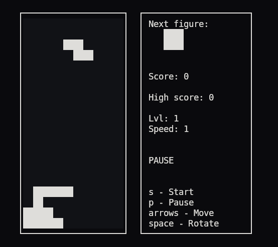

# BrickGame Тетрис
В данном проекте я реализовать игру «Тетрис» на языке программирования С с использованием структурного подхода.

## Введение

Проект состоит из двух частей: библиотеки, реализующей логику работы игры, которую можно в будущем подключать к различным GUI, и терминального интерфейса.

Внешний вид в консоле

Реализован doxygen. Покрытие тестами gcov.

## Сборка

cd src/
make
